# Tutorial de criação de função Lambda com trigger em AWS API Gateway

### Passo 1:
No seu painel principal do AWS Lambda, clique no botão `Create Function` (`Criar Função`).

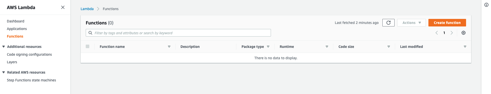

### Passo 2:
Na tela de criação de função selecione a opção `Author from Scratch` (`Criar do zero`).
Insira um nome para sua função.
Selecione a versão da engine do Node JS que deve ser usada
Na área `Execution Role` (`Papel de execução`) deixe a opção padrão para que o lambda crie uma role padrão
com permissão de envio de dados para o CloudWatch.

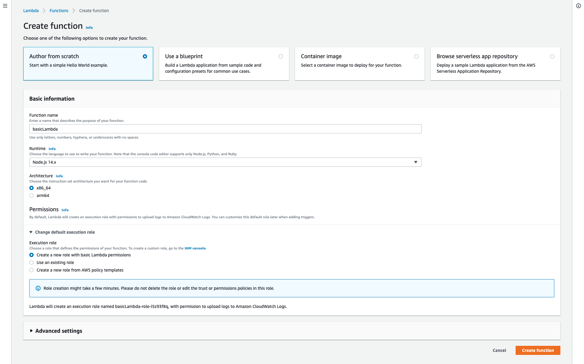

### Passo 4:
Na tela da função lambda cole o conteúdo do arquivo `function/index.js`, salve e clique no botão `Deploy`
para disponibilizar a função lambda para execução.

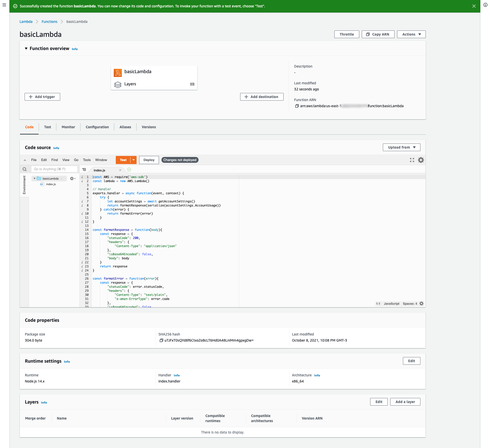

### Passo 5:
Na aba `Configuration` (Configuração) selecione o item `Permissions` (`Permissões`) no menu lateral esquerdo,
e em seguida clique na role exibida na caixa `Execution Role` (`Papel de Execução`) para ir para a tela do 
IAM.

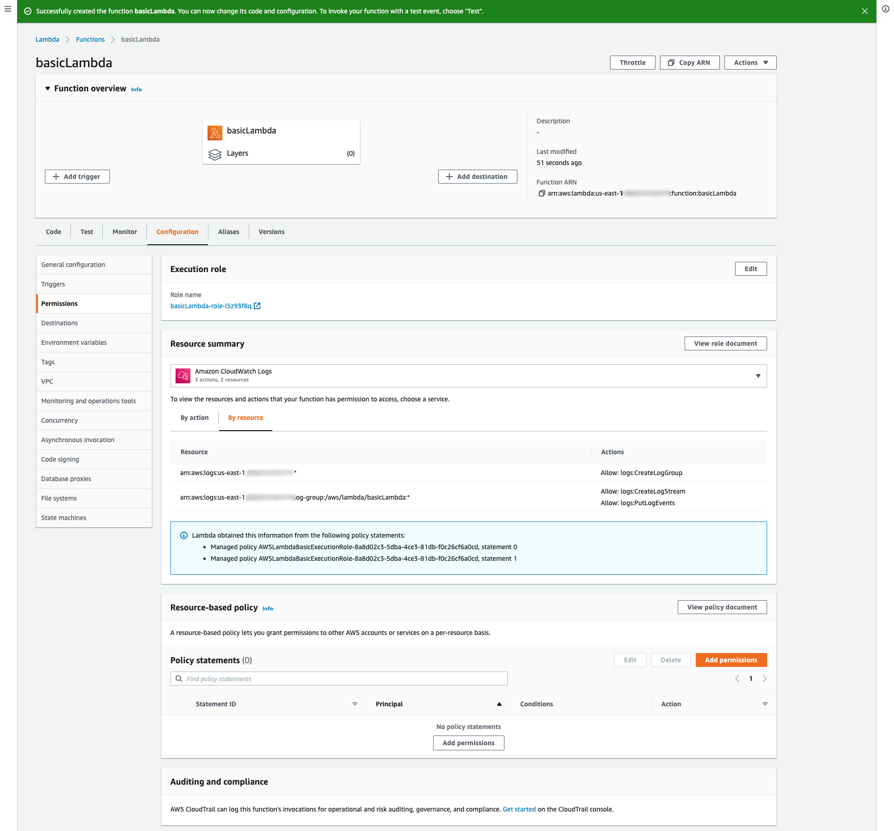

### Passo 6:
Na tela de detalhes da role no IAM, você tem duas opções, criar uma nova `policy` (`política`) ou adicionar
uma política em linha, vamos pela segunda opção, então ao lado direito clique no link `Add inline policy`
(`Adicionar política em linha`).

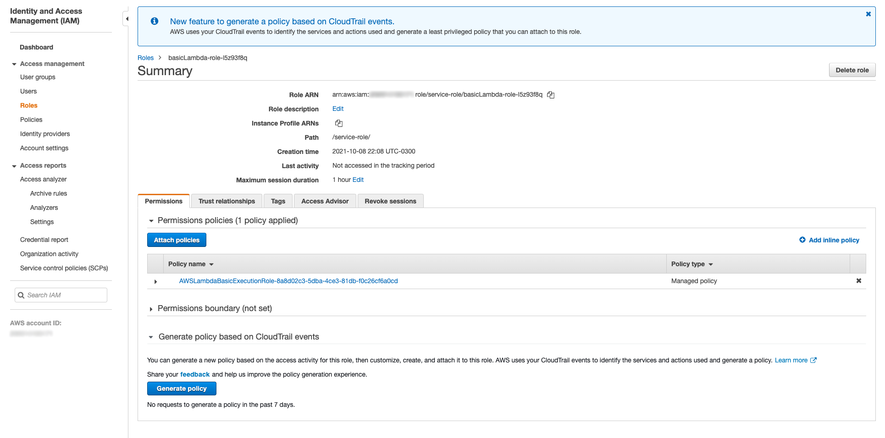

### Passo 7:
Clique em `Choose a service` (`Escolha um serviço`) e digite `lambda` no campo de busca. 

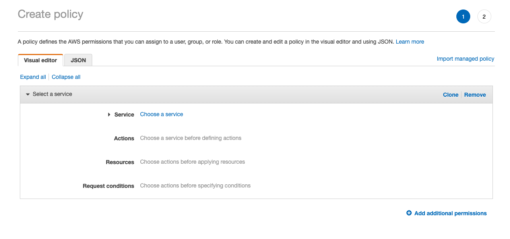

### Passo 8:
Selecione a opção `Lambda` nos resultados abaixo.

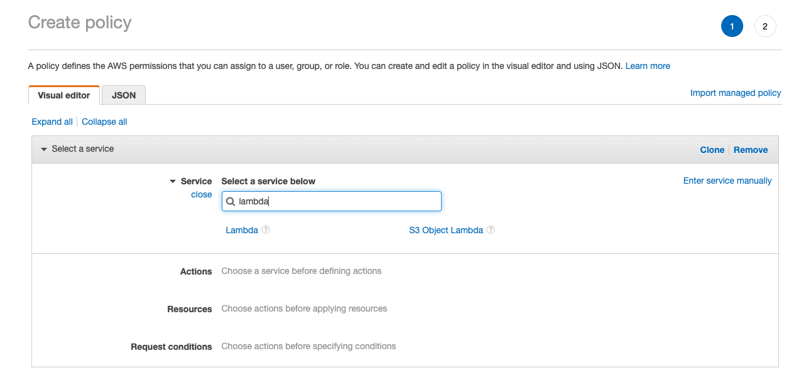

### Passo 9:
No item `Access level` (`Nível de acesso`) selecione o item `Read` (`Leitura`) para expandir as opções e marque 
a opção `GetAccountSettings`. Clique em `Review Policy` (`Revisar política`).

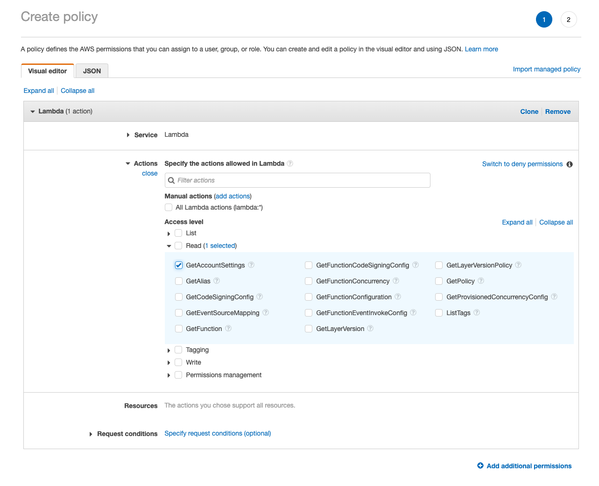

### Passo 10:
Dê um nome para sua nova política de segurança, e clique em `Create Policy` (`Criar Política`). 

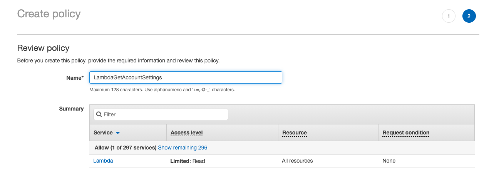

### Passo 11:
Agora você deve poder ver a sua nova política listada na role da sua função lambda. 

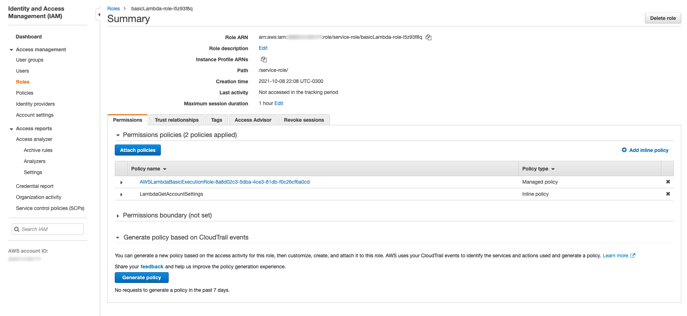

### Passo 12:
De volta a tela da sua função lambda, clique no botão `Add Trigger` (`Adicionar Gatilho`) e selecione a opção
API Gateway.

### Passo 13:
Selecione `Create an API` (`Criar uma API`).
Selecione `REST API` (`API REST`).
Em `Security` (`Segurança`) selecione a opção `Open` (`Abrir`).
Digite um nome para sua API.
Na opção `Deployment stage` (`Estágio de implantação`) digite `dev`.
Deixe o restante das opções como padrão e clique em `Add` (`Adicionar`).

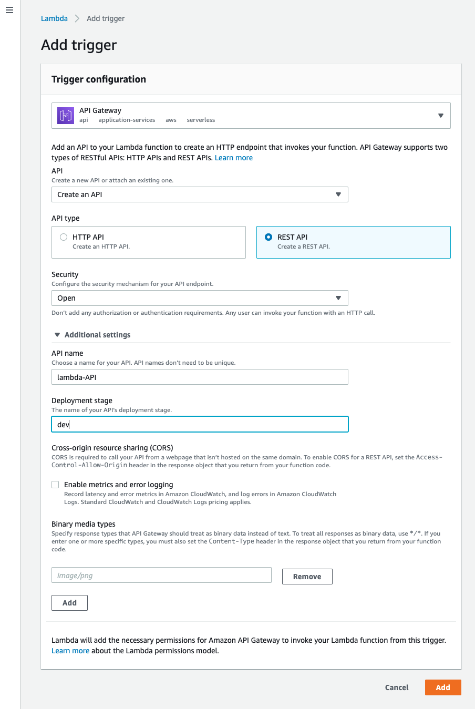

### Passo 14:
Agora na lista de trigger você pode visualizar sua API já criada e o `API Endpoint` (`Endpoint da API`), que é 
o endereço que você deve usar no seu navegador para invocar sua função lambda.

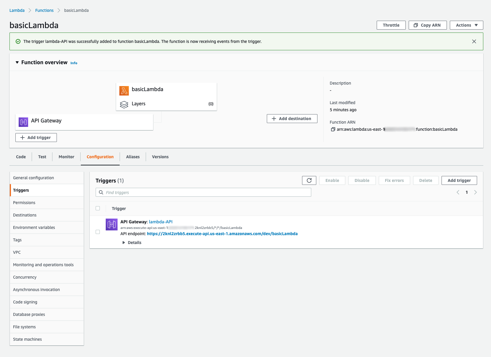

### Passo 15:
Este é o resultado da sua função.

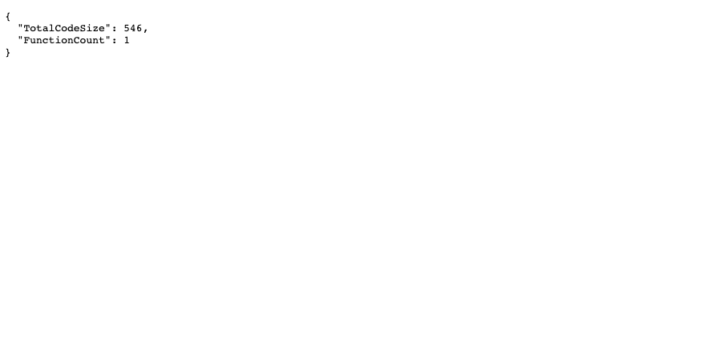

### Passo 16:
Na aba `Monitor` você terá acesso às métricas e logs da sua função e poderá conferir informações como o número 
de vezes que sua função foi invocada, tempo de resposta entre outras.

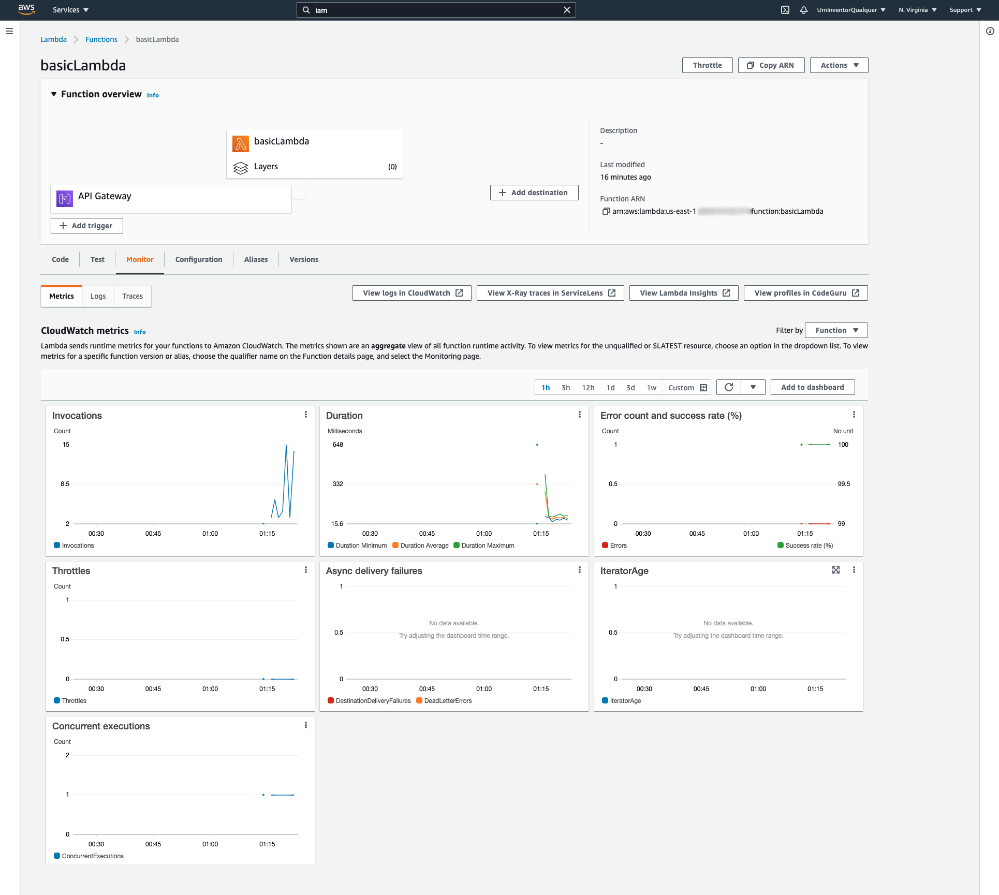

### Passo 17:
Ainda na aba `Monitor` da sua função lambda você pode ver os logs detalhados de acesso.

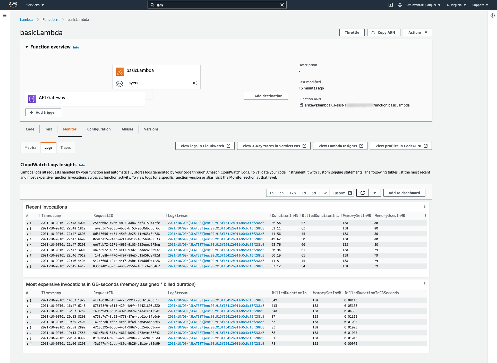

### Passo 18:
Entrando no painel do AWS API Gateway, é dessa maneira que a configuração do seu API Gateway irá parecer quanto
a integração com sua função lambda. 

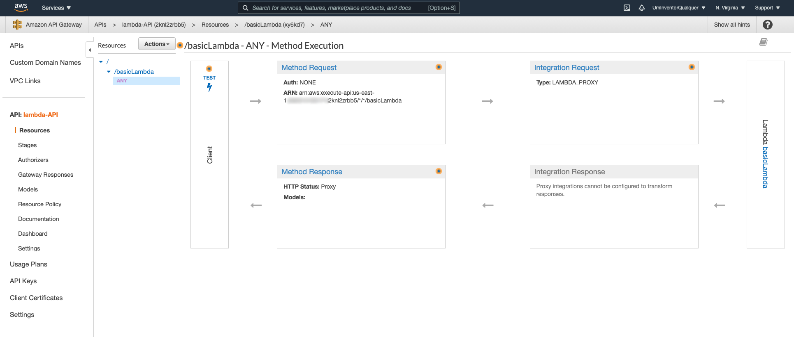

